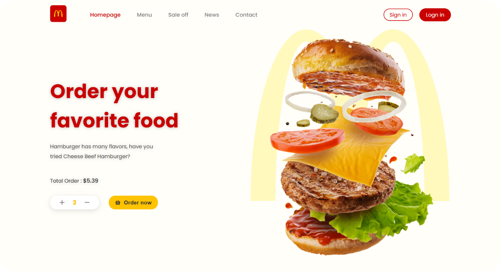

<div align="center">

<!-- Animated typing effect -->


<br/>

### 🍔 A modern, fully responsive fast-food delivery website

<br/>

<!-- Fancy Live Demo Button -->
<a href="https://salehsarlak.github.io/a-responsive-website/">
  
</a>

<br/><br/>

[](https://developer.mozilla.org/en-US/docs/Web/HTML)
[](https://developer.mozilla.org/en-US/docs/Web/CSS)
[](https://remixicon.com/)
[](https://salehsarlak.github.io/a-responsive-website/)

</div>

---

## ✨ Features

- 🎨 **Modern & Clean UI** — Beautiful design with smooth visual hierarchy
- 📱 **Fully Responsive** — Looks perfect on mobile, tablet and desktop
- 🍔 **Interactive Menu** — Best sellers, hamburgers, drinks, desserts & fried chicken
- 🔥 **Sale Off Section** — Eye-catching special offers
- 📍 **Store Locator** — Find nearest Foodeli store
- ⚡ **Lightweight** — Pure HTML + CSS (no heavy frameworks)
- 🎭 **Remix Icons** — Beautiful and consistent icon set

---

## 🖼️ Preview

<div align="center">
  
  
  <br/><br/>
  
  <!-- Fancy Live Demo Button -->
  <a href="https://salehsarlak.github.io/a-responsive-website/">
    
  </a>
</div>

---

## 🛠️ Tech Stack

| Technology       | Description                          |
|------------------|--------------------------------------|
| **HTML5**        | Semantic and accessible structure    |
| **CSS3**         | Modern layout, flexbox & animations  |
| **Remix Icons**  | Clean and beautiful icon library     |
| **Vanilla JS**   | Minimal (if any) interactivity       |

---

## 📂 Project Structure

```text
a-responsive-website/
├── index.html              # Main page
├── assets/
│   ├── css/
│   │   └── style.css       # All styles
│   └── img/                # Food images & logo
└── README.md
```

---

## 🚀 How to Run Locally

1. Clone the repository:
   ```bash
   git clone https://github.com/salehsarlak/a-responsive-website.git
   ```
2. Open `index.html` in your browser

That’s it! No build step needed.

---

## 🌐 Live Demo (GitHub Pages)

This project is deployed with **GitHub Pages**.

<div align="center">
  <a href="https://salehsarlak.github.io/a-responsive-website/">
    
  </a>
</div>

> If the link doesn’t work yet, go to **Settings → Pages** and set Source to `main` branch / root.

---

## 👨‍💻 Author

**Saleh Sarlak**  
Web Designer & WordPress Developer | Founder of [Tarhfam](https://tarhfam.ir)

- GitHub: [@salehsarlak](https://github.com/salehsarlak)
- Instagram: [@ixxsaleh](https://instagram.com/ixxsaleh)
- LinkedIn: [salehsarlak](https://www.linkedin.com/in/salehsarlak)

---

<div align="center">

### Made with ❤️ and lots of ☕ by Saleh Sarlak

⭐ If you like this project, give it a star!

</div>